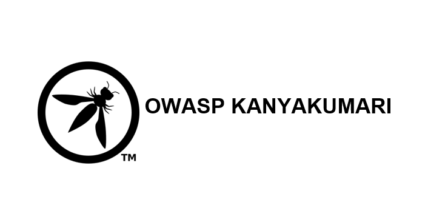

---

layout: col-sidebar
title: OWASP Kanyakumari
tags: OWASP Kanyakumari Chapter
region: Asia
meetup-group:
country: India
postal-code: 629175
---

# Welcome

Welcome to the Kanyakumari chapter homepage. Kanyakumari OWASP Chapter was started on September 2021. We host information security events, seminars, and workshops.
Everyone is welcome to attend and contribute their knowledge at any of the events, meetings, or seminars that are organised. Everyone is welcome to contribute their thoughts.

## Participation
The Open Web Application Security Project (OWASP) is a nonprofit foundation that works to improve the security of software. All of our projects ,tools, documents, forums, and chapters are free and open to anyone interested in improving application security. 

Chapters are led by local leaders in accordance with the [Chapters Policy](/www-policy/operational/chapters). Financial contributions should only be made online using the authorized online donation button. To be a SPEAKER at ANY OWASP Chapter in the world simply review the [speaker agreement](/www-policy/legal/speaker-agreement) and then contact the local chapter leader with details of what OWASP Project, independent research, or related software security topic you would like to present.

Everyone is welcome and encouraged to participate in our [Projects](/projects/), [Local Chapters](/chapters/), [Events](/events/), [Online Groups](https://groups.google.com/a/owasp.com/){:target='_blank'}, and [Community Slack Channel](https://owasp.slack.com/){:target='_blank'}. We especially encourage diversity in all our initiatives. OWASP is a fantastic place to learn about application security, to network, and even to build your reputation as an expert. We also encourage you to be [become a member](/membership/) or consider a [donation](/donate/) to support our ongoing work.

## Call for Speakers

Would you like to speak on the upcoming OWASP Kanyakumari Meetings? 
Contact:
  [Merbin Russel](mailto:merbin.russel@owasp.org) (or)
  [RAGAVENDER A G](mailto:ragavender.ag@owasp.org)

**Email Format :**

- Speaker name
- Job Role
- Company / Organization
- Country
- Email ID
- Contact Number
- Speaker Profile
- Presentation Details
    - Name / Title of the Presentation
    - Abstract of the presentation
    - Presentation time required

Next Meeting/Event <!-- You should keep this section as it will populate your meetup events -->
---------------------


